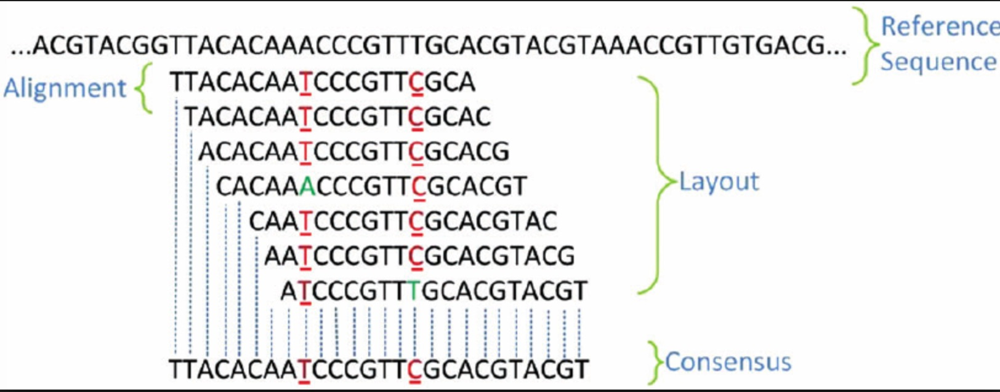

## __Alignment Tutorial | Bowtie__

--- 

After quality control and optional adapter trimming of our data, alignment is usually the next step. Alignment tools provide us to determine where in the genome the reads originated from. To apply this procedure, we first need a reference genome to map our reads. If your read is spliced such as RNA-seq data, then, spliced transcripts alignment tools such as STAR aligner would be the right choice. 

How does alignment algorithm work?

Reads are aligned to a reference sequence. The alignment process may allow one or more mismatches between each individual read and the reference sequence. The alignment of the reads generates a layout. Based on the majority base call, the layout produces a consensus sequence. 
___

### __Bowtie Syntax__
___
bowtie-build:

    bowtie-build [options]* <reference_in> <ebwt_base>

bowtie:

    bowtie [options]* <ebwt> {-1 <m1> -2 <m2> | --12 <r> | --interleaved <i> | <s>} [<hit>]

__Main arguments__
<ebwt>
The basename of the index to be searched. The basename is the name of any of the index files up to but not including the final .1.ebwt / .rev.1.ebwt / etc. bowtie looks for the specified index first in the current directory, then in the indexes subdirectory under the directory where the bowtie executable is located, then looks in the directory specified in the BOWTIE_INDEXES environment variable.

<m1>
Comma-separated list of files containing the #1 mates (filename usually includes _1), or, if -c is specified, the mate sequences themselves. E.g., this might be flyA_1.fq,flyB_1.fq, or, if -c is specified, this might be GGTCATCCT,ACGGGTCGT. Sequences specified with this option must correspond file-for-file and read-for-read with those specified in <m2>. Reads may be a mix of different lengths. If - is specified, bowtie will read the #1 mates from the “standard in” filehandle.

<m2>
Comma-separated list of files containing the #2 mates (filename usually includes _2), or, if -c is specified, the mate sequences themselves. E.g., this might be flyA_2.fq,flyB_2.fq, or, if -c is specified, this might be GGTCATCCT,ACGGGTCGT. Sequences specified with this option must correspond file-for-file and read-for-read with those specified in <m1>. Reads may be a mix of different lengths. If - is specified, bowtie will read the #2 mates from the “standard in” filehandle.

<r>
Comma-separated list of files containing a mix of unpaired and paired-end reads in Tab-delimited format. Tab-delimited format is a 1-read-per-line format where unpaired reads consist of a read name, sequence and quality string each separated by tabs. A paired-end read consists of a read name, sequnce of the #1 mate, quality values of the #1 mate, sequence of the #2 mate, and quality values of the #2 mate separated by tabs. Quality values can be expressed using any of the scales supported in FASTQ files. Reads may be a mix of different lengths and paired-end and unpaired reads may be intermingled in the same file. If - is specified, bowtie will read the Tab-delimited reads from the “standard in” filehandle.

<i>
A comma-separated list of interleaved paired-end FASTQ files, where the records for the mate #1s are interleaved with the records for the mate #2s. Reads may be a mix of different lengths. If - is specified, Bowtie reads from the “standard in” filehandle.

<s>
A comma-separated list of files containing unpaired reads to be aligned, or, if -c is specified, the unpaired read sequences themselves. E.g., this might be lane1.fq,lane2.fq,lane3.fq,lane4.fq, or, if -c is specified, this might be GGTCATCCT,ACGGGTCGT. Reads may be a mix of different lengths. If - is specified, Bowtie gets the reads from the “standard in” filehandle.

<hit>
File to write alignments to. By default, alignments are written to the “standard out” filehandle (i.e. the console).
___
### __Hands-on__
___

1. Get the tutorial material

        cp -r /cta/users/eekmen/gwsta_alignment_tutorial gwsta_alignment_tutorial
2. Unzip the .gz files in __reads__ directory. 

        gunzip *.gz

3. Creating Index Files in __index__ directory:

       bowtie-build e_coli.fna e_coli

4. Single-end Alignment:

       bowtie index/e_coli reads/CZB152.solexa.fastq e_coli_solexa.map

5. Paired-end Alignment:

       bowtie -p 2 index/e_coli -1 reads/b95edefdb9d82cb2423d97172223bbd4_1.fastq -2 reads/b95edefdb9d82cb2423d97172223bbd4_2.fastq e_coli_paired.map

___

### __Some Links__

1. Pre-built indexes: https://support.illumina.com/sequencing/sequencing_software/igenome.html
___
### __References:__

1. Langmead B, Salzberg S. Fast gapped-read alignment with Bowtie 2. Nature Methods. 2012, 9:357-359.

